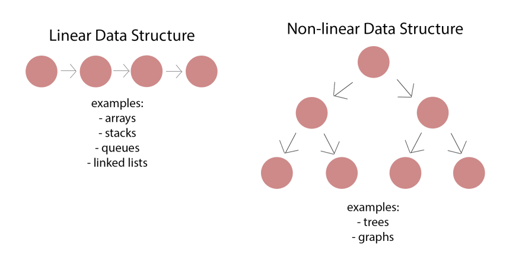

# Data Structures in JavaScript

## Introduction To Data Structures

*Data Structures are the group of data elements which provides an efficient way of storing and organising data in the computer.*

*Data structures are the main part of computer science algorithms as they enable the programmers to handle the data in an efficient way. it plays a vital role in enhancing the performance of a software or a program as the main function of the software is to store and retrieve the user's data as fast as possible.*

### Types of Data Structures

#### data structures are divided into two categories:

* **Linear Data Structures**: *A linear data structure has data elements connected to each other so that elements are arranged in a sequential manner and each element is connected to the element in front of it and behind it. This way, the structure can be traversed in a single run. and some examples of linear Data Structures are: Array, Linked list, Stack, Queue*

* **Non-linear Data Structures**: *Non-linear data structures, on the other hand, are non-sequential, meaning the information they contain does not need to be ordered one after another. In addition, one element could be connected to two or even more elements, making it unlikely for you to be able to traverse through all of the data in one iteration. Typically, implementing linear data structures tends to be easier than implementing non-linear ones. and some examples of non-linear Data Structures are: Maps, Trees, Graphs,*

### Example of Data structures are:

* Arrays
* Linked lists
* Stacks
* Queues
* Sets
* Maps
* Binary Trees
* Heaps
* Graphs

> ### The Completed Data Structures Branches:

* [Stacks](https://github.com/sidiDev/data-structures/tree/stacks)